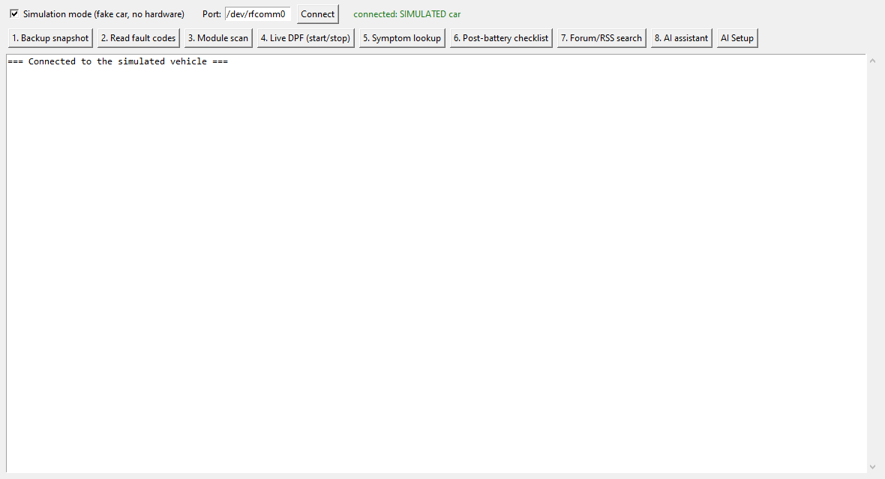
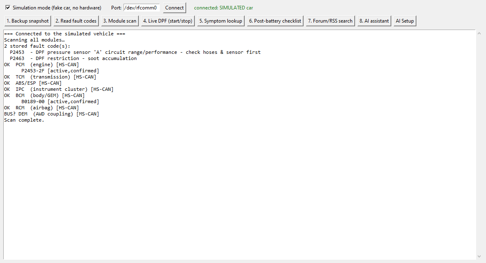
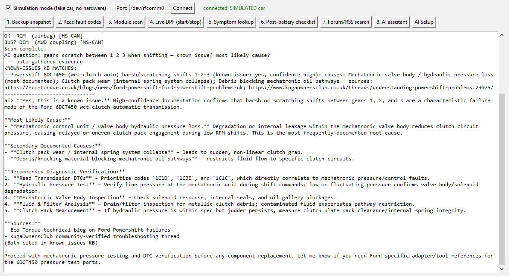

# ford-tdci-recovery

[](https://github.com/jobluemann/ford-tdci-recovery/actions/workflows/test.yml)

Backup-first **open-source diagnostic suite** for **Ford 2.0 TDCi** vehicles
(Kuga Mk2, Focus Mk3 and platform relatives). Born from the known condition
where the PCM loses its adaptations after a **battery replacement** — now
grown into a full-vehicle tool with a curated, sourced **known-issues
knowledge base**, so owners stop paying dealer diagnostic fees to rediscover
faults that are already documented as standard problems on their model.

Runs on **Windows (portable, no admin install)** and **Linux Mint**, over an
**ELM327 adapter via USB or Bluetooth**. GUI included — no command line
needed. One dependency (`pyserial`). See `docs/ARCHITECTURE.md` for the vision.

## See it running

Every screenshot below is the **real app**, captured by
`docs/make_screenshots.py` against the built-in simulated car:







A full end-to-end session (backup → module scan → KB verdicts → live AI
diagnoses of five real faults) is in
[docs/EXAMPLE_SESSION.md](docs/EXAMPLE_SESSION.md) — regenerate it any time
with `python example_session.py`.

## For mechanics: the 2-minute AI setup

The AI assistant is free and takes two minutes to switch on — no command
line, no environment variables:

1. In the app, click **AI Setup**.
2. Follow the on-screen link to **console.groq.com**, sign in, create a free
   API key (no credit card).
3. Paste the key into the box, press **Save + Test**.
4. Green ✓ — done. The key is stored locally on the laptop
   (`data/ai_config.json`, git-ignored) and remembered forever.

The assistant then runs a two-model pipeline: a fast model interrogates the
gathered KB/forum evidence first, then a reasoning model (Qwen) writes the
diagnosis — always grounded in the sourced known-issues database, never
guessing. The offline symptom lookup works with no key at all.

## Suite features (v0.4)

- **Desktop GUI** (`python gui_app.py`) — every feature is a button;
  simulation mode lets you try the whole suite with no car and no adapter.
- **Backup before anything else** — snapshots all readable vehicle state to
  timestamped JSON; clearing codes is refused until a backup exists.
- **Fault-code decoding** with Ford DPF-specific descriptions.
- **Full module scan** — PCM, TCM, ABS/ESP, cluster, BCM, airbag, and the
  DEM (AWD) module, with per-module UDS fault codes the dashboard never
  shows. (MS-CAN modules need an adapter with an HS/MS-CAN switch.)
- **Known-issues lookup** — your DTCs + plain-English symptoms are ranked
  against a curated KB (Powershift 6DCT450 harsh shifts, silent AWD pump
  failure, coolant-in-oil paths, DPF sensor circuit, and more), every entry
  marked `yes/no known issue` with confidence, ranked causes, checks and
  **source links**.
- **Forum/RSS symptom search** across your configured feeds, with offline
  cache.
- **AI assistant with in-app setup** — click "AI Setup", paste a free Groq
  key, done. Two-model pipeline (fast research model → Qwen diagnostics),
  auto-grounded in the KB + forum evidence, VIN stripped, reasoning hidden.
  Any OpenAI-compatible endpoint works (`.env.example` has presets).
- **Community data platform** — `site/` drops onto any PHP host (no Node):
  anonymized opt-in reports power a shared fault database.
- **Live DPF differential pressure** readout with CSV logging.
- **Expert UDS reflash framework** (`pcm_flasher.py`) — bring your own
  seed/key and firmware; wired-only guardrails.

## What it deliberately does not do

- No sensor emulation, signal spoofing, or DPF "override". A generic ELM327
  cannot inject analog sensor signals at all, and emissions defeat is
  illegal for road vehicles. This tool exists to *fix the actual fault*.
- No seed/key security access. PATS keys, module As-Built blocks and
  learned-value reset routines are Ford-proprietary — use
  [FORScan](https://forscan.org) (free) alongside this tool for those.

## Install & run

```bash
pip install -r requirements.txt   # just pyserial
python gui_app.py                 # the app (default: simulated car — no hardware)
python gui_app.py --real          # the app on a real ELM327 adapter
python ford_recovery.py --demo    # CLI demo with a simulated ECU
python ford_recovery.py           # CLI on a real adapter: pick the port
python ford_recovery.py --port COM5          # Windows, skip port selection
python ford_recovery.py --port /dev/rfcomm0  # Linux Mint Bluetooth
python example_session.py         # full example session -> docs/EXAMPLE_SESSION.md
```

No admin rights are needed to run it on Windows — any Python 3.8+ works,
including the portable/embeddable distribution.

## Bluetooth setup

**Windows:** pair the adapter (PIN usually `1234` or `0000`), then check
*Bluetooth settings → More Bluetooth options → COM ports* for the **outgoing**
COM port. Pass it with `--port`.

**Linux Mint:**
```bash
bluetoothctl pair <MAC> && bluetoothctl trust <MAC>
sudo rfcomm bind 0 <MAC>        # one-time, needs sudo for the bind itself
python ford_recovery.py --port /dev/rfcomm0   # the app itself runs as user
```

**Android:** this project targets laptops. On Android, use *Car Scanner ELM*
(live data) or *FORScan Lite* (Ford service functions) with the same
Bluetooth adapter.

**Note for Ford-specific functions:** learned-value resets and forced
regeneration via FORScan need an ELM327 with an **HS/MS-CAN switch**; many
cheap Bluetooth adapters are HS-CAN only.

## Project layout

```
gui_app.py              desktop GUI entry point (simulation mode by default)
ford_recovery.py        CLI entry point (diagnostics/backup)
example_session.py      end-to-end example -> docs/EXAMPLE_SESSION.md
demo_fake_car.py        scripted "owner's car" demo (4 known faults)
pcm_flasher.py          expert UDS reflash entry point (you supply seed/key + firmware)
ftr/gui.py              tkinter app — all features as buttons + AI Setup dialog
ftr/elm327.py           ELM327 transport (USB/Bluetooth serial) + simulator
ftr/obd.py              DTC / VIN / Mode-09 / PID decoding
ftr/backup.py           full readable-state snapshot (JSON)
ftr/cli.py              interactive menu
ftr/uds.py              UDS (ISO 14229) client over ELM327
ftr/vbf.py              VBF firmware container parser
ftr/flasher.py          flash orchestration + scripted simulator
ftr/modules.py          Ford module map + full-vehicle scan + simulator
ftr/known_issues.py     multi-vehicle KB loader + symptom matcher
ftr/feeds.py            forum/RSS symptom search (stdlib, cached)
ftr/aichat.py           AI assistant: two-model pipeline, auto-grounding, presets
ftr/aiconfig.py         saved AI settings (no env vars needed; git-ignored)
ftr/share.py            anonymized community report builder
ftr/server.py           HTTP bridge for the PWA (--serve)
data/known_issues/      one JSON per vehicle — the scaling unit
site/                   PHP collector + viewer + PWA (no Node needed)
dpf_tool.py             legacy standalone DPF tool (superseded by the suite)
dpf_failure_diagram.html  DPF failure-point map
config/                 flash plan skeletons (placeholder values — verify!)
docs/POST_BATTERY_PROCEDURE.md
docs/PCM_REPLACEMENT_GUIDE.md   when the module itself has failed
docs/DIY_REFLASH_NOTES.md       expert in-vehicle reflash: inputs & safety
docs/ARCHITECTURE.md            suite design + scaling
docs/EXAMPLE_SESSION.md         full example session with live AI diagnoses
docs/screenshots/               real app captures (docs/make_screenshots.py)
backups/                your snapshots land here (git-ignored)
```

## Scaling to other makes and models

The architecture is deliberately layered so growth is **data, not code**:

1. **Universal core (works on any OBD-II vehicle, ~2008+):** ELM327 transport,
   standard Mode 01/03/09 diagnostics, backup snapshots, the PWA, the bridge.
   Nothing here is Ford-specific.
2. **Make packs (per manufacturer):** module maps (`ftr/modules.py` table —
   CAN IDs per make), Mode-22 PID tables, flash-plan skeletons.
3. **Model KBs (per vehicle):** `data/known_issues/<vehicle>.json` — one file
   per model, community-sourced via PRs. This is where the project scales
   indefinitely without the code getting heavier.

Practical limit: the *diagnostics* scale to everything with an OBD-II port
today; the *curated value* (known-issues KBs) scales with contributors. The
realistic path is Ford platform first, then VW/Toyota packs as contributors
with those vehicles arrive.

## Phone / browser app (PWA)

`site/pwa/` is an installable PWA: offline known-issues browser + symptom
matcher out of the box; live diagnostics when it can reach the bridge
(`python ford_recovery.py --serve 8765`) running on a laptop or Raspberry Pi
connected to the car. Host it on any static/PHP host — no Node anywhere.

## License

MIT — see LICENSE. Use at your own risk; always snapshot before clearing.
